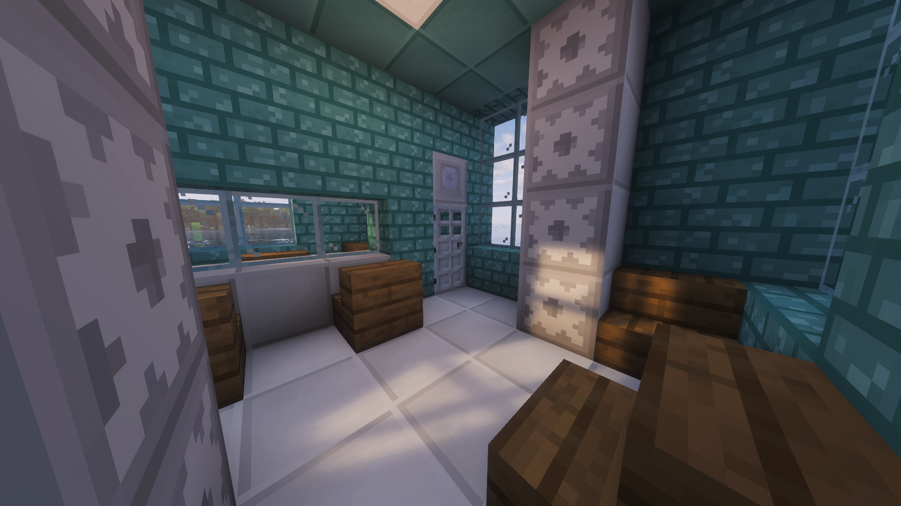

# LlamaBlocks Documentation

This is a detailed set of user & developer documentation for LlamaBlocks hosted in its own [GitHub repository](https://github.com/Omegabird113/LlamaBlocks-Documentation/) and is synced into the `/documentation` folder of the main LlamaBlocks repository and then published to its [own website](https://omegabird113.github.io/llamamod/).

## The Mod Itself

LlamaBlocks is a complex, multi-year long development, mod which adds a ton of features. These include 702 variants of custom building blocks, the complex Computer block with a calculator and much more, a password system for improved game-immersion, many custom storage items, a custom Banana farming item with some cool gimmicks, a custom damaging fluid named `Acid`, and more!

### Showcase Images

## The Index

The easiest way to get around the documentation is to visit the [Index](page-index.md) which describes the exact structure of the documentation.

## Contributing to the Documentation

You can help improve the LlamaBlocks documentation by simply making a [Pull Request to the documentation's GitHub repository](https://github.com/Omegabird113/LlamaBlocks-Documentation/pulls).
