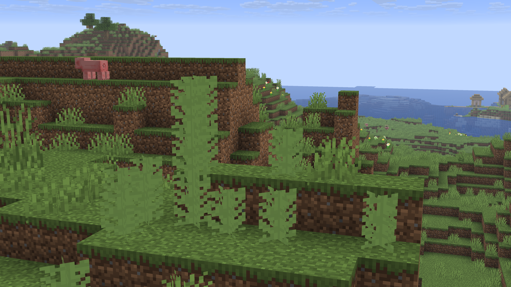

# Banana Patches
Banana Plants naturally generate in Banana Patches, and here's some info about them:
- They can generate in the following biomes: *`Flower Forest`, `Forest`, `Jungle`, `Cherry Grove`, `Plains`*
- They can only generate on Grass and Dirt blocks
- They have a `1/70` chance of attempting to generate in a chunk

