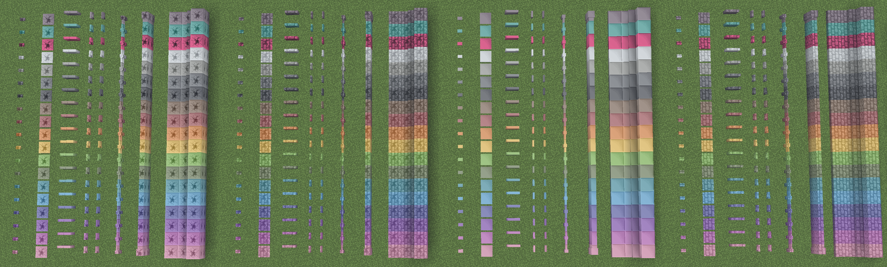

# Blocksets
There are 3 massive sets of building blocks:

1. The custom colored bricks
2. The custom cracked colored bricks
3. The Large Tiles

Each set comes in 19 colors:

- All **16 vanilla colors** *(White, Light Gray, Gray, Black, Brown, Red, Orange, Yellow, Lime, Green, Cyan, Light Blue, Blue, Purple, Magenta, Pink)*
- Industrial (Netherite-colored) variants
- Cherry (Hot Pink) variants
- Teal variants

There are also Tiles *(Black and White checkered)* and Ceiling Tiles *(Blue and Light Gray checkered)*.

Each color variant, or tile type, has a corresponding block set, which includes the following:

- A full block
- A stair
- A slab
- A wall
- A fence
- A fence gate
- A trapdoor
- A pressure plate
- A button

## Showcase Image

