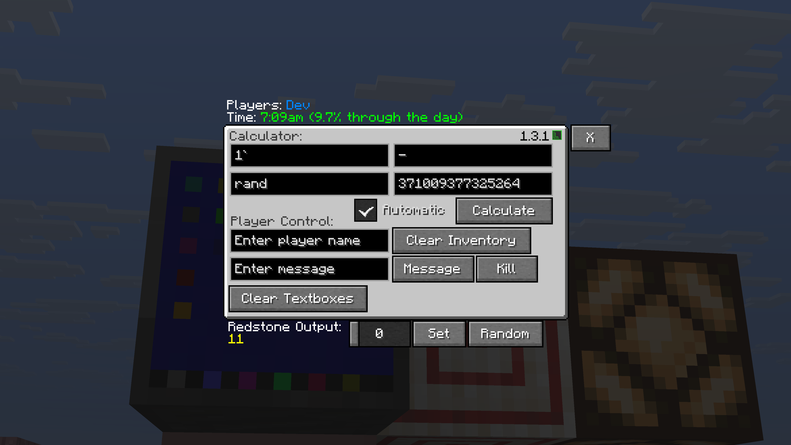

# Computer
The Computer offers a variety of features for information, math, player management, and more. Here's a list of its features:

- It supports having passwords with the Password System, so only people with access can use the other features
- Players can send messages to other players
- Operators can clear the inventory of and kill players
- Players can access a formatted string of the 24-hour time (e.g. `7 o'clock (10% through the day)`)
- Players can set a redstone output between 0 and 15, and they can choose to have the computer pick a random power output between 0 and 15.
- It shows a list of the names of every player connected to a world/server.
- The contents of all textboxes in the computer are automatically saved to that computer and reloaded when the Computer is reopened.

## Showcase Image

## Computer Calculator
The Computer has a calculator function, which can be used to calculate an output between 1 or 2 numbers. There's is a manual calculate button and also a `Automatic` checkbox which re-calculates every tick, when enabled.

### Special Numbers
The Computer Calculator supports the irrational numbers `pi` and `e` to be entered, alongside the errors `nan`, `inf`, and `-inf`.

### Two Value Operations
| Operators in Computer | Common Name           | 
|-----------------------|-----------------------|
| `+`                   | Addition              |
| `-`                   | Subtraction           |
| `*` or `x`            | Multiplication        |
| `/`                   | Division              |
| `^`                   | Exponent              |
| `MOD`                 | Modulo/Remainder      |
| `MIN`                 | Minimum               |
| `MAX`                 | Maximum               |
| `ATAN2`               | 2-arg Arctangent      |
| `HYPOT`               | Hypotenuse            |
| `AND`                 | Bitwise AND           |
| `OR`                  | Bitwise OR            |
| `XOR`                 | Bitwise XOR           |
| `LOG`                 | LogBASE(`#1`) of `#2` |
| `RAND`                | Random Inclusive      |
| `RANDEX`              | Random Exclusive      |
| `ROOT`                | `#1` Root `#2`        |

### One Value Operations
| Operators in Computer | Common Name                   | 
|-----------------------|-------------------------------|
| `NLOG`                | Natural Logarithim            |
| `ROUND`               | Round to Nearest Whole        |
| `CEIL`                | Round Up                      |
| `FLOOR`               | Round Down                    |
| `SQRT`                | Square Root                   |
| `3ROOT`               | Cube Root                     |
| `ABS`                 | Absolute Value                |
| `SIGNUM`              | Sign Function                 |
| `SIN`                 | Sine Function                 |
| `COS`                 | Cosine Function               |
| `TAN`                 | Tangent Function              |
| `ASIN`                | Arcsine or Inverse Sine       |
| `ACOS`                | Arccosine or Inverse Cosine   |
| `ATAN`                | Arctangent or Inverse Tangent |
| `LOG10`               | Log Base 10                   |
| `RAD>DEG`             | Radian to Degree Conversion   |
| `DEG>RAD`             | Degree to Radian Conversion   |
