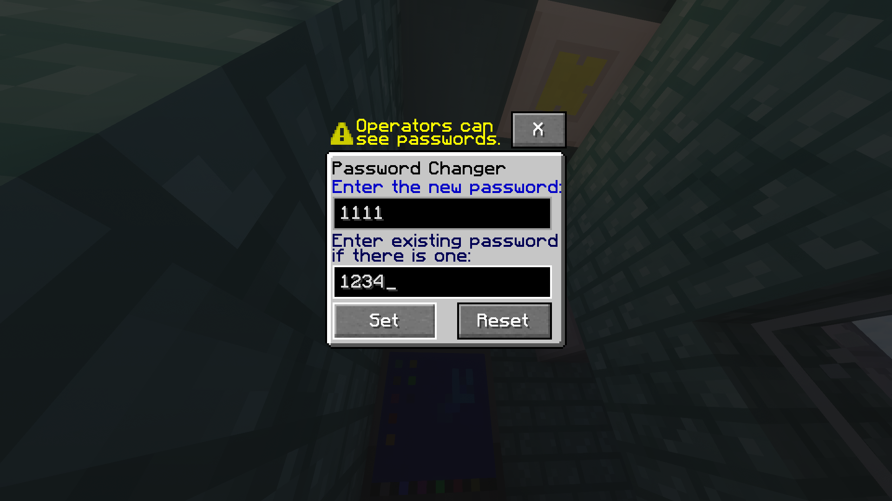

# Password System
The Secure Storage Block, Computer, and Authenticator all support passwords which are required to access them.

## Setting/Changing a Password
You can use a `Password Changer` to update the password of a block. If the block does not have a password yet, leave the existing password field blank, otherwise enter the existing password, and enter your new password into the new password field.

> [!Warning]
> The `Password Changer` allows for you to edit passwords of blocks that do not support passwords, though it does show a warning in that case. 

## How blocks Handle Having No Password
- The `Computer` and `Secure Storage Block` skip the authentication screen and just go on to the block.
- The authenticator requires the password field to be left blank in order for it to succeed.

## Important Security Concerns
1. **Operators can see any password**, meaning that passwords aren't actually private from them.
2. **Passwords are basically stored in plaintext**, this means that from a cybersecurity perspective, it is very unsafe to put a real password into LlamaBlocks.

> [!Note]
> These issues are currently not possible for me to fix, due to the fact that MCreator does not support any form of cryptographic hashing function.

> More specifically, passwords are stored in a NBT text tag named `access_password`, which can be easily viewed using the vanilla `/data` command.

